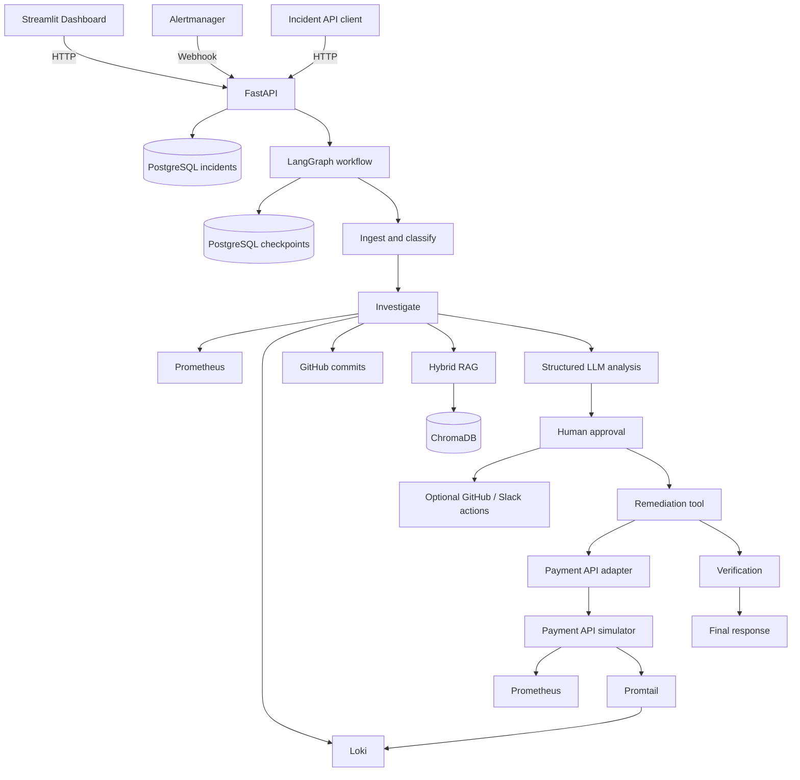

# AI-SRE Incident Triage & Remediation Agent

AI-SRE Incident Triage & Remediation Agent is a Python incident-response system that receives incidents through FastAPI or Alertmanager, gathers operational evidence, produces structured LLM analysis, and coordinates approval-gated remediation through LangGraph. The included remediation adapter operates against a local payment API simulator, not production infrastructure.

## Why This Project?

- Demonstrates rule-based incident classification.
- Investigates metrics, logs, GitHub commits, and retrieval context concurrently.
- Uses structured LLM output for root-cause and remediation planning.
- Combines BM25 and vector retrieval with reciprocal-rank fusion.
- Pauses for explicit human approval before response actions.
- Persists LangGraph checkpoints in PostgreSQL.
- Uses adapter-based remediation and post-remediation metric verification.

## Overview

An incident enters through the incident API or the Alertmanager webhook. The workflow classifies it, investigates current and historical context, asks an LLM for structured analysis, pauses for approval, optionally performs external actions, executes the approved simulator remediation, verifies service metrics, and produces a final response.

Incident records are stored in PostgreSQL. LangGraph state is checkpointed separately in PostgreSQL so an approval workflow can resume using its persisted thread ID.

## Key Features

- FastAPI incident and Alertmanager webhook endpoints.
- LangGraph workflow with human-in-the-loop approval.
- Prometheus metrics, Loki logs, and GitHub commit investigation.
- Structured `IncidentAnalysis` and `RemediationPlan` Pydantic models.
- Hybrid BM25/vector RAG using ChromaDB and Hugging Face embeddings.
- PostgreSQL incident storage and `AsyncPostgresSaver` checkpoints.
- Optional GitHub issue and Slack notification actions.
- Local payment API simulator with an adapter for `increase_database_pool`.
- Streamlit dashboard for investigation, analysis, approval, execution, and verification state.
- Docker Compose configuration for the local supporting services.

## Architecture



The dashboard communicates with FastAPI over HTTP. It does not directly access PostgreSQL or LangGraph checkpoints. The FastAPI application is normally run on the host, while the supporting services are defined in `docker/docker-compose.yml`.

## Incident Workflow

The graph in `app/graph/graph.py` registers these nodes:

1. **`ingest_incident`** validates the incident ID, service, and message.
2. **`classify_incident`** assigns a category and severity using the current rule-based logic.
3. **`investigate_incident`** concurrently collects metrics, logs, commits, and RAG evidence.
4. **`analyze_incident`** sends the incident and evidence to the structured LLM analyzer.
5. **`request_approval`** pauses with a LangGraph interrupt.
6. **`execute_external_actions`** attempts configured GitHub and Slack actions after approval.
7. **`execute_remediation_action`** runs the approved adapter-backed remediation.
8. **`verify_remediation`** checks post-remediation metrics.
9. **`generate_final_response`** assembles the final workflow response.

### Incident lifecycle

```text
Created → Classified → Investigated → Analyzed
        → Pending approval → Approved/Rejected
        → Remediation → Verification → Final response
```

Rejected approval routes directly to the final response; remediation and verification are skipped.

## Human-in-the-Loop

The LLM recommends a remediation, but a human must decide whether it may run:

```text
Analysis
   ↓
Human approval
   ├── Reject → Final response
   └── Approve → External actions
                    ↓
                Remediation
                    ↓
                Verification
                    ↓
                Final response
```

The approval endpoint is:

```text
POST /api/v1/incidents/{incident_id}/approval
```

It accepts `decision` (`approve` or `reject`) and an optional `reason`. The route loads the incident's persisted `thread_id` and resumes the paused graph with `Command(resume=...)`. Approval status and reason are stored with the incident.

## AI / RAG

`app/analysis/analyzer.py` uses `ChatOpenAI` with the configured XKIRO-compatible endpoint and returns the `IncidentAnalysis` schema, including:

- Root cause, confidence, reasoning, and supporting evidence
- A typed `RemediationPlan`
- Expected impact and risks

The analyzer receives incident details plus current metrics, logs, recent commits, and historical/runbook retrieval evidence. The RAG pipeline:

1. Loads PDF, TXT, and Markdown files from `app/rag/corpus`.
2. Splits them into chunks.
3. Searches ChromaDB with Hugging Face embeddings.
4. Combines vector results with LangChain BM25 results using reciprocal-rank fusion.

RAG supplies context; it does not execute actions or bypass approval.

## Observability

### Metrics

`PrometheusTool` queries Prometheus for:

- Request rate: `rate(<prefix>_requests_total[1m])`
- Error rate: error request rate divided by request rate
- Average latency: histogram sum rate divided by histogram count rate

The payment simulator exports `payment_requests_total`, `payment_errors_total`, and `payment_request_duration_seconds`. Prometheus scrape and alert rules are in `docker/prometheus.yml` and `docker/alerts.yml`.

### Logs

`LogsTool` queries Loki's `query_range` API with LogQL labels such as:

```text
{container="ai-sre-payment-api"}
```

Promtail discovers Docker container logs and sends them to Loki. The payment simulator emits structured JSON logs.

### GitHub

`GitHubTool` retrieves recent commits for the configured repository. After approval, the optional GitHub action can create an incident issue. Missing configuration or API failures are recorded as action failures rather than treated as guaranteed success.

## Remediation

The generic `RemediationTool` maps an action name to an adapter. The current startup registration maps:

```text
increase_database_pool → PaymentAPIAdapter
```

The adapter calls the local simulator:

```text
POST http://localhost:8001/admin/remediation/database-pool
```

The simulator changes its pool size and clears its simulated database failure mode. This is simulator-backed local behavior, not production infrastructure automation. Verification queries Prometheus again and records before/after metrics and a `passed` or `failed` result.

Slack notification is another optional external action using `SLACK_WEBHOOK_URL`; it is attempted only when configured and its result is recorded.

## Tech Stack

| Category | Technology |
|---|---|
| Language | Python 3.11+ |
| API and server | FastAPI, Uvicorn |
| Workflow | LangGraph |
| LLM integration | LangChain `ChatOpenAI` |
| Validation | Pydantic |
| Database | PostgreSQL, SQLAlchemy, psycopg |
| Checkpoints | `langgraph-checkpoint-postgres`, `AsyncPostgresSaver` |
| Migrations | Alembic |
| Metrics | Prometheus |
| Logs | Loki, Promtail |
| Retrieval | ChromaDB, Hugging Face embeddings, BM25 |
| Dashboard | Streamlit |
| Infrastructure | Docker Compose |
| Testing | Pytest, `pytest-asyncio`, HTTPX |

## Project Structure

```text
ai-sre-incident-triage-agent/
├── app/
│   ├── actions/                 # GitHub and Slack actions
│   ├── adapters/simulator/      # Payment API remediation adapter
│   ├── analysis/               # LLM analyzer and schemas
│   ├── api/                    # FastAPI routes
│   ├── db/                     # Models, repository, migrations
│   ├── graph/                  # State, nodes, graph compilation
│   ├── investigation/          # Concurrent evidence collection
│   ├── rag/                    # Ingestion and hybrid retrieval
│   └── tools/                  # Prometheus, Loki, GitHub, Slack, remediation
├── dashboard/streamlit_app.py
├── data/chroma/
├── docker/                     # Compose and observability configuration
├── scripts/
├── simulator/services/payment_api/
├── tests/
├── .env.example
├── alembic.ini
└── pyproject.toml
```

## Prerequisites

- Python 3.11 or newer
- Docker Desktop with Docker Compose
- An LLM API key and compatible endpoint
- GitHub repository settings if GitHub investigation or issue creation is used
- Slack webhook settings if Slack notification is used

## Configuration

Copy the example file:

```powershell
Copy-Item .env.example .env
```

The current implementation reads these environment variables:

| Variable | Purpose |
|---|---|
| `DATABASE_URL` | SQLAlchemy and PostgreSQL connection URL |
| `PROMETHEUS_URL` | Prometheus API base URL |
| `LOKI_URL` | Loki API base URL |
| `GITHUB_TOKEN` | Optional GitHub API token |
| `GITHUB_OWNER` | GitHub repository owner |
| `GITHUB_REPO` | GitHub repository name |
| `SLACK_WEBHOOK_URL` | Optional Slack incoming webhook |
| `XKIRO_API_KEY` | Required analyzer API key |
| `XKIRO_BASE_URL` | Analyzer API base URL |
| `XKIRO_MODEL` | Analyzer model |

The analyzer raises an error at import time if `XKIRO_API_KEY` is not configured.

## Running the Project

Start the local infrastructure from the repository root:

```powershell
docker compose -f docker/docker-compose.yml up -d
alembic upgrade head
```

Start FastAPI:

```powershell
uvicorn app.main:app --reload
```

On Windows, `app/main.py` sets `WindowsSelectorEventLoopPolicy` before the asynchronous PostgreSQL pool is created.

Start the dashboard in a separate terminal:

```powershell
streamlit run dashboard/streamlit_app.py
```

Configured service ports include FastAPI `8000`, the payment simulator `8001`, Prometheus `9090`, Loki `3100`, Alertmanager `9093`, and PostgreSQL `5432`.

## API

### Create an incident

`POST /api/v1/incidents/`

```json
{
  "incident_id": "INC-DEMO-001",
  "service": "payment-api",
  "message": "Database connection pool exhausted",
  "error_rate": 0.65
}
```

### Other routes

```text
GET  /health
GET  /api/v1/incidents/
GET  /api/v1/incidents/{incident_id}
POST /api/v1/incidents/{incident_id}/approval
POST /api/v1/alerts/
```

Alertmanager is configured to send its webhook to:

```text
http://host.docker.internal:8000/api/v1/alerts
```

## Dashboard

[Dashboard screenshot can be added here]

The Streamlit dashboard reads incident summaries and details from FastAPI. It displays current investigation metrics, logs, recent commits, analysis, approval state, execution state, and verification state when those values are available.

## Testing

Install the declared project and development dependencies, then run:

```powershell
pytest
```

Focused suites:

```powershell
pytest tests/unit -v
pytest tests/integration -v
pytest tests/workflow -v
```

Integration and workflow tests may require PostgreSQL, local observability services, configured LLM access, or other environment variables used by the exercised path.

## Limitations

- Remediation is limited to the local payment API simulator and is not production automation.
- The default investigation path assumes the payment simulator container name used by the local Docker setup.
- Prometheus, Loki, GitHub, Slack, and the configured LLM endpoint are external dependencies for their respective paths.
- The dashboard is an HTTP client of FastAPI; it does not directly access the database or checkpoints.
- The project is an educational and portfolio implementation, not a claim of production readiness.
